尊敬的华为云开发者，

您好，本文档指导HCCDA-AI认证考试的账号注册、考试券兑换、在线学习、在线认证考试等相关问题，请详细阅读。
重点关注：账号签署开发者协议、绑定邮箱、认证考试中携带身份证件信息。

# 注册华为云账号
华为云注册链接：https://www.huaweicloud.com/

HCCDA-AI认证学习链接：<https://edu.huaweicloud.com/certificationindex/developer/aaabf9760a3f4578aa620155e1fcae86>

# 检查是否签订开发者协议

## 查看是否已签订开发者协议
1. 登陆**华为云**
2. 进入**开发者个人中心**
    
3. 进入开发者个人中心-**个人主页**，查看**开发者服务协议**状态。

> 如果为"已签署"则表示已签署开发者协议。

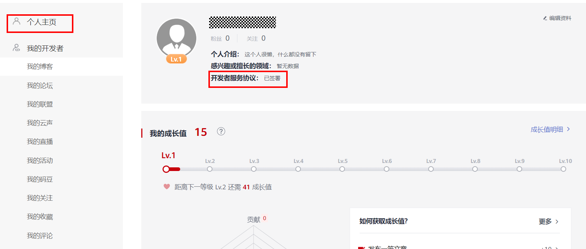

## 签订开发者协议
> 如果未签订协议，开发者服务协议状态为"未签署"，可以点击旁边的签署，进行签署。

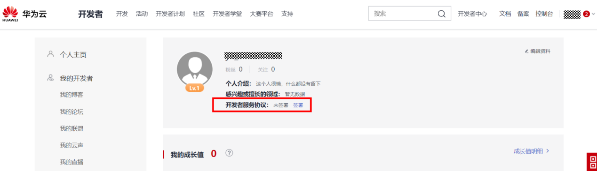

# 检查华为云账号是否正确

## 不要将华为账号当成华为云账号（目前此类问题是最多的）
> 如下图，上面的账号名是华为账号，下面的租户名才是华为云账号。当两个账号相同或者升级统一后，下面的租户名会隐藏。

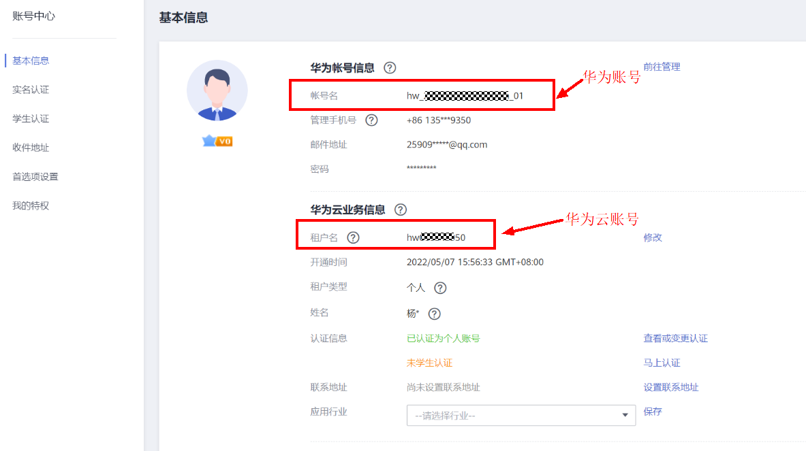

## 注意区分账号的大小写

# 检查是否绑定邮箱
> 邮箱一定要提前三天绑定，否则影响考试。

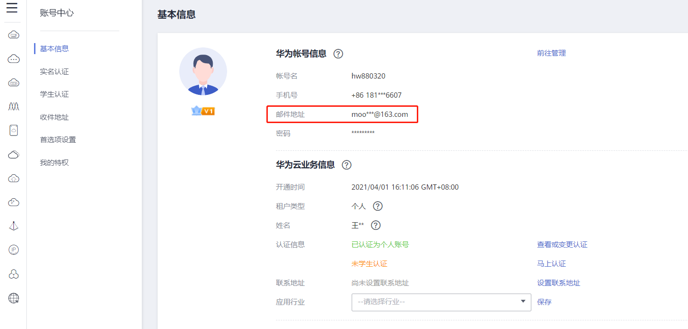

# 电脑上存身份证照片
> 在线认证考试需要上传身份证照片与人像校对，为方便请提前拍照留存。

# 统计反馈学员账号信息
请按照excel表格模板统计学员信息并反馈，提前申请考试券。

# 查看考试券

## 打开华为云链接[**huaweicloud.com**](https://www.huaweicloud.com/) 登录账号；

## 点击开发者，进入开发者；
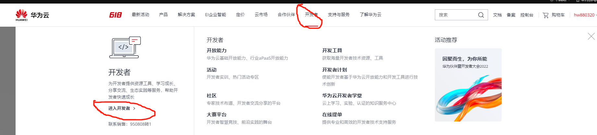

## 进入控制台；
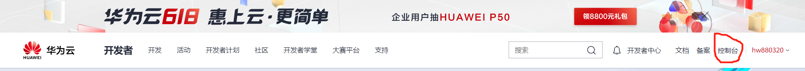

## 进入费用中心；
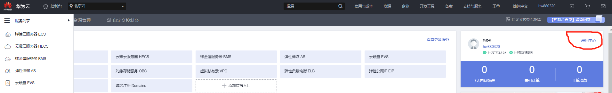

## 查看考试券；
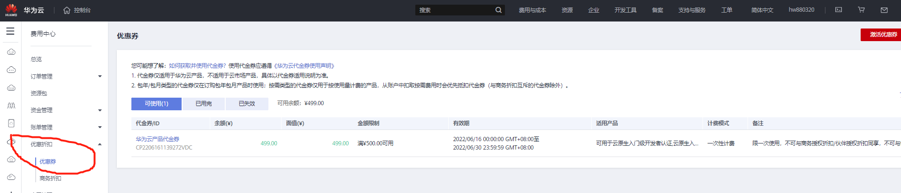

# 购买认证考试资格

## 报考认证地址
> <https://edu.huaweicloud.com/certificationindex/developer/aaabf9760a3f4578aa620155e1fcae86>点击报考认证

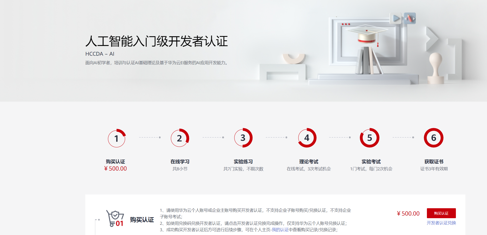

## 点击购买认证
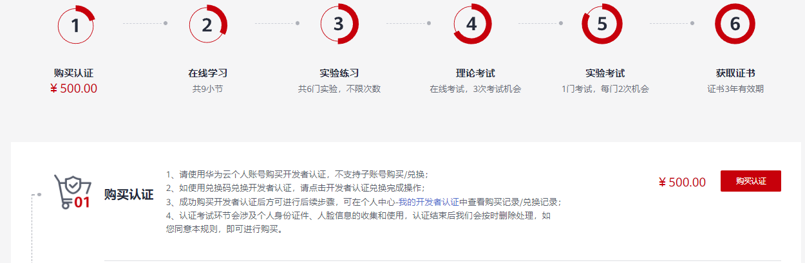

## 选择不涉及销售人员
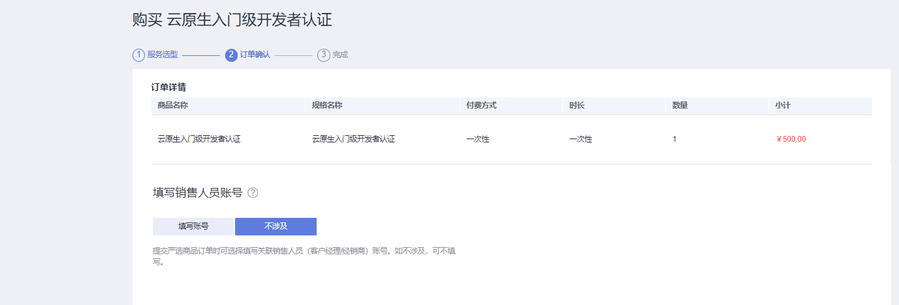

## 支付订单，选择代金券支付，需要补支付1块钱。
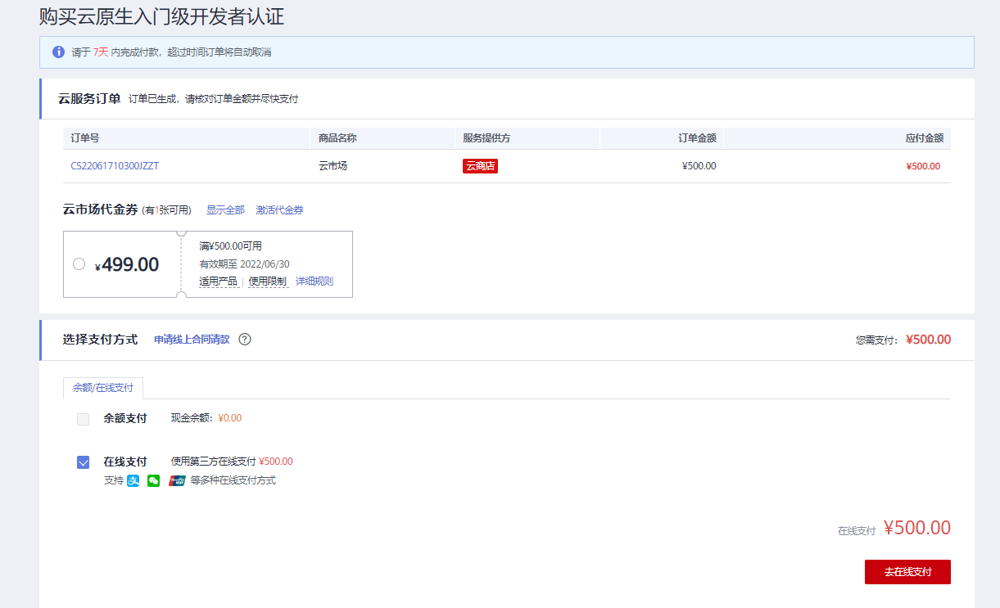

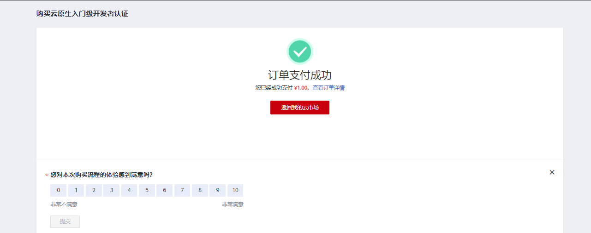

## 支付成功后点击返回我的云市场---\>我的认证我的开发者认证开始学习考试。可以不用学习直接点击理论考试，完了进行实验考试。查看我的证书可获取证书。
