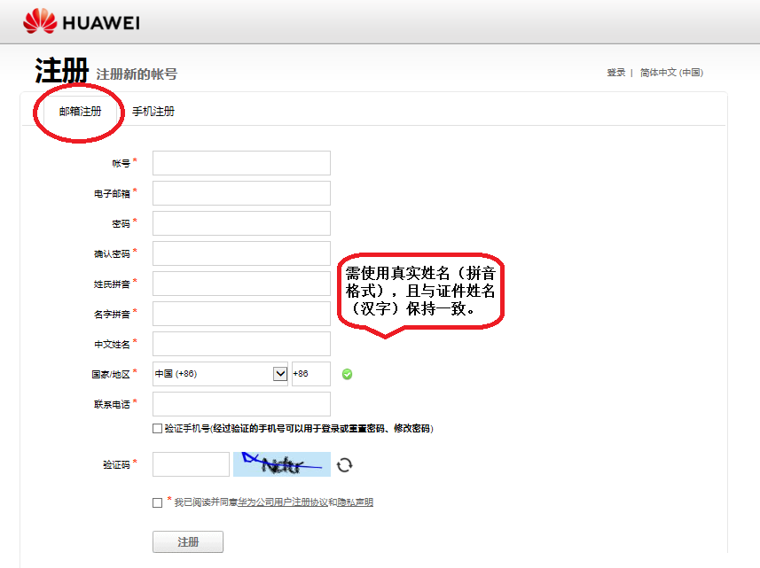
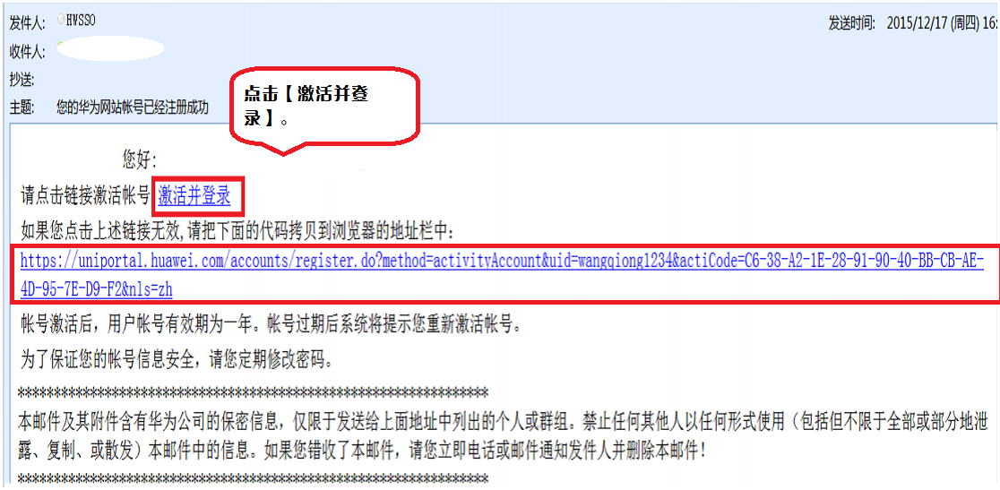
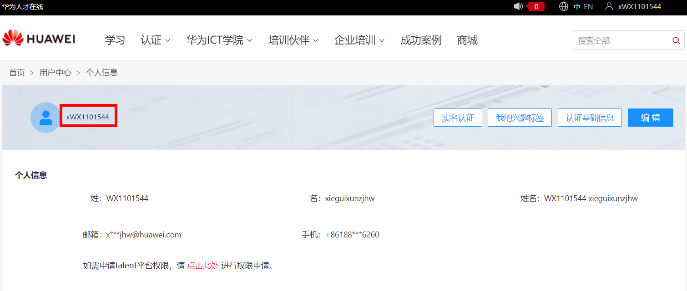

**Uniportal账号注册及查询指引**

# **注册华为Uniportal账号**

## 1.1 注册华为账号

### （1）访问华为网站，进入<https://uniportal.huawei.com/uniportal>账号登录或申请页面后，按网站信息提示，正确填写信息并提交。如下图所示：

【特别提醒】
- 请使用邮箱注册。
- 账号创建时，需使用真实姓名（拼音格式），且与证件姓名（汉字）保持一致。

### （2）完成账号激活。信息提交后，系统会自动发送激活链接到注册时预留的电子邮箱中。

## 1.2 华为账号/密码常见问题处理
更多华为账号/密码常见问题，请访问华为网站:
<https://uniportal.huawei.com/uniportal/help_zh.html?ver=v3r24>

# **查询华为Uniportal账号**
1. 登录华为人才在线平台：<https://e.huawei.com/cn/talent/#/personal/myinfo>
2. 在用户中心查看Uniportal账号

